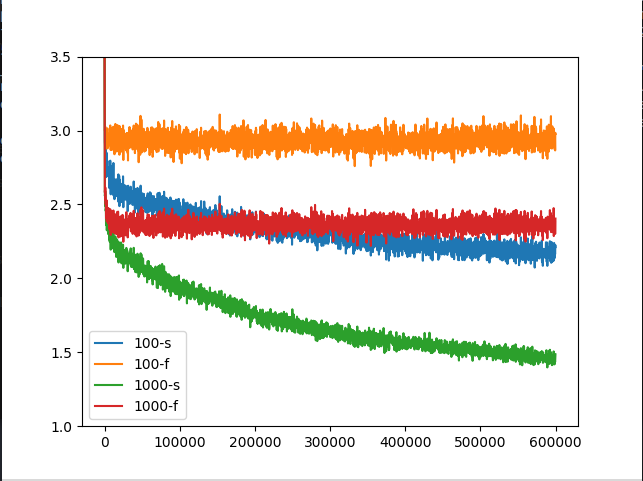

# Representation Learning (RLAI)

The given code is the implementation of the paper [Generate and Test by Mahmood and Sutton (2013)](https://armahmood.github.io/files/MS-RepSearch-AAAI-WS-2013.pdf). This provides two methods of learning representations one called the fixed representation the other one that updates the features according to utility. The code uses *Second Tester* in order to determine utility (See paper.)


#### Requirements

- Python 3.x

- Pytorch 1.0+
- Numpy
- Matplotlib
- Progressbar2

#### Usage

##### Running locally:

Use python script directly.

- Fixed Representation:

```python
python learner.py -f [size of features seperated by space] -n [number of runs for each feature] -s [seed value for learning networks(each run) seperated by space] 
```

Other flags can be seen by:

```python
python learner.py -h
```

- Using search

```python
python learner.py --search [other flags]
```

##### Running on a server/parallel runs:

See `run.sh` an example slurm script for parallel runs. Modify seeds and runs according to use. 

```bash
sbatch run.sh {number of feature(only one)}
```

The losses are saved as pickle files(for each run) and results can be visualised as follows.

- For fixed representations:

```python
python plot_graph.py -f {size of features seperated by space} -s {Seed array}
```

- For search use `--search` flag. If you need to compare fixed representation and search results use `--plot_all` flag.

#### Example result:

Here X axis represents number of examples and Y axis loss. `-s` is using search `-f` is fixed representation.

