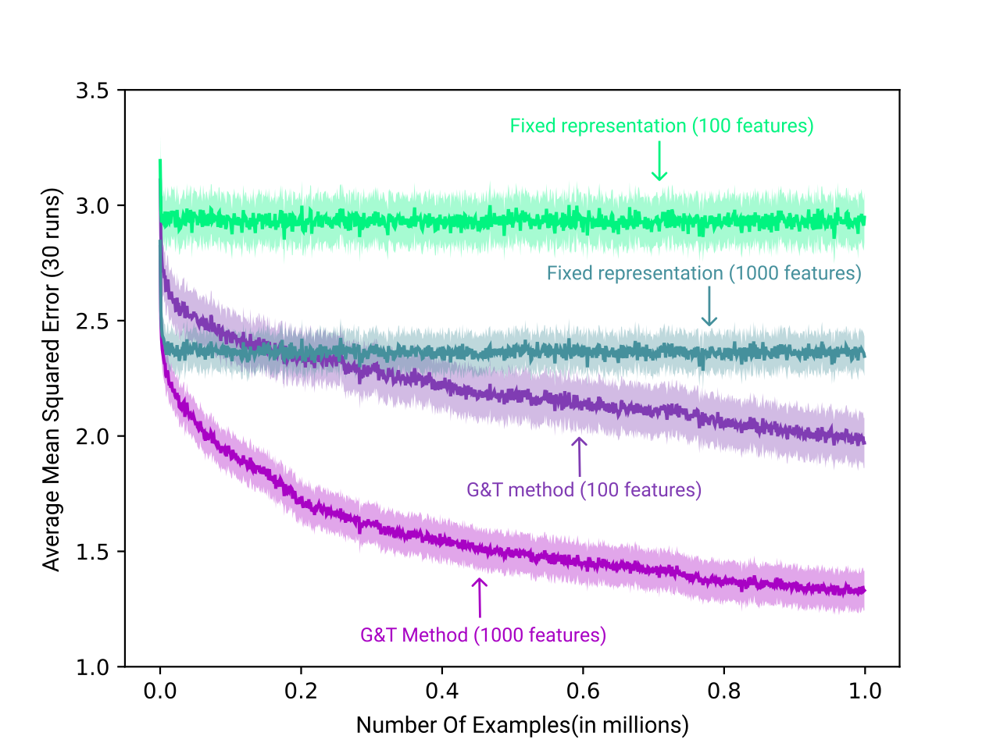

# Representation Learning (RLAI)

The given code is the implementation of the paper [Generate and Test by Mahmood and Sutton (2013)](https://armahmood.github.io/files/MS-RepSearch-AAAI-WS-2013.pdf). This provides two methods of learning representations one called the fixed representation the other one that updates the features according to utility. The code uses *Second Tester* in order to determine utility (See paper.)


#### Requirements

- Python 3.x

- Pytorch 1.7+
- Numpy
- Matplotlib
- tqdm

#### Usage

##### Config file:

The file `config.json` contains the parameters associated with the run. This can be modified for different runs. See running on server section for parrallel runs.

##### Running locally:

Use python script directly.

- Fixed Representation:

```python
python learner_original.py
```

Other flags can be seen by:

```python
python learner_original.py -h
```

- Using search

```python
python learner_original.py --search
```

##### Running on a server/parallel runs:

For parallel runs you need to generate temporary configuration files by editing `master_config.json` and adding parameters of your choice then use:

```bash
python generate_config.py
```

This will create a temporary directory then with config files corresponding to the runs. Use `--cfg` flag to locate them. And an example script for slurm job loader is given as `run.sh`. Don't forget to use `--store-losses` flag with parallel runs.

The losses are saved as pickle files(for each run) and results can be visualised as follows.

- For fixed representations:

```python
python plot_graph.py -f {size of features seperated by space} -s {Seed array}
```

- For search use `--search` flag. If you need to compare fixed representation and search results use `--plot_all` flag. For replacement rate and step size variation use `rrstep.py` and `rrdr.py` for replacement rate and decay rate variation plots.
- `learner_x.py` is LTU +Adam and `learner_xrel.py` is for other activations+ Adam.

#### Example result:

Here X axis represents number of examples and Y axis loss. `-s` is using search `-f` is fixed representation.



### 


** code will be updated with modules soon.